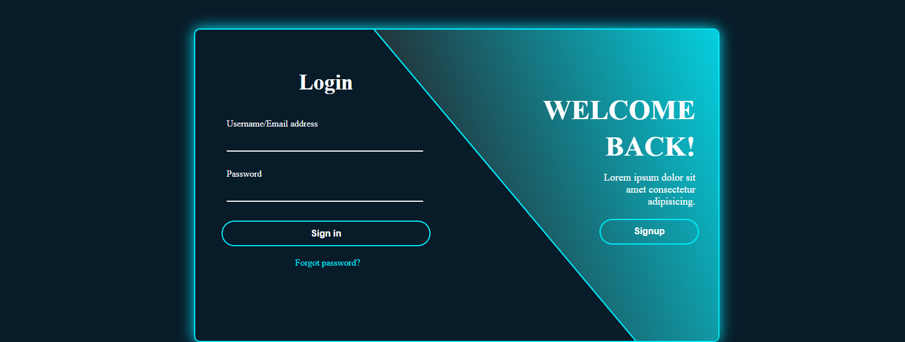

# 🔐 Login / Signup Toggle App

A clean and elegant **React.js authentication interface** that allows users to toggle between **Login** and **Signup** forms seamlessly — built using the power of React Hooks (`useState`).  
Perfect as a starter template for any authentication-based project.

---

## 🚀 Live Demo

👉 **[View Live on Vercel](https://login-signup-toggle-app.vercel.app/)**  
*(You can deploy easily on Vercel, Netlify, or GitHub Pages.)*

---

## 🖼️ Preview



*(💡 Tip: Add a screenshot of your app in the repo root as `preview.png` so it appears above.)*

---

## ✨ Features

- 🔄 Toggle between **Login** and **Signup** forms using React state  
- 🧠 Built with React Hooks (`useState`)  
- 🎨 Simple and modern UI with inline styling  
- 🧱 Component-based clean structure (`Login`, `Signup`, `App`)  
- ⚡ No page reload — smooth transitions  
- 🪄 Easy to expand with backend (Node.js / Firebase)

---

## 📁 Folder Structure

vite-project/
│
├── 📂 public/
│ ├── bg.png
│ └── vite.svg
│
├── 📂 src/
│ ├── 📂 assets/
│ │ └── react.svg
│ │
│ ├── 📂 Components/
│ │ ├── 📂 Login/
│ │ │ ├── Login.jsx
│ │ │ └── Login.css
│ │ │
│ │ ├── 📂 Signup/
│ │ │ ├── Signup.jsx
│ │ │ └── Signup.css
│ │
│ ├── App.jsx
│ └── main.jsx
│
├── .gitignore
├── eslint.config.js
├── index.html
├── package.json
├── package-lock.json
├── vite.config.js
└── README.md

---

## 🛠️ Technologies Used

| Technology | Purpose |
|-------------|----------|
| **React.js** ⚛️ | UI rendering and state management |
| **CSS3** 🎨 | Styling and responsiveness |
| **JavaScript (ES6)** 💡 | Core logic and interactivity |
| **Vite** ⚡ | Fast React development environment |

---

## 💡 How to Run Locally

1. **Clone the Repository:**
   ```bash
   git clone https://github.com/your-username/login-signup-toggle-app.git

## 👨‍💻 Developer

**Muhammad Bilal**  
📧 [bilalusman1291@gmail.com](mailto:bilalusman1291@gmail.com)  
🌐 [Portfolio](https://imuhammadbilal.vercel.app/)  
🐙 [GitHub](https://github.com/Bilal742)
